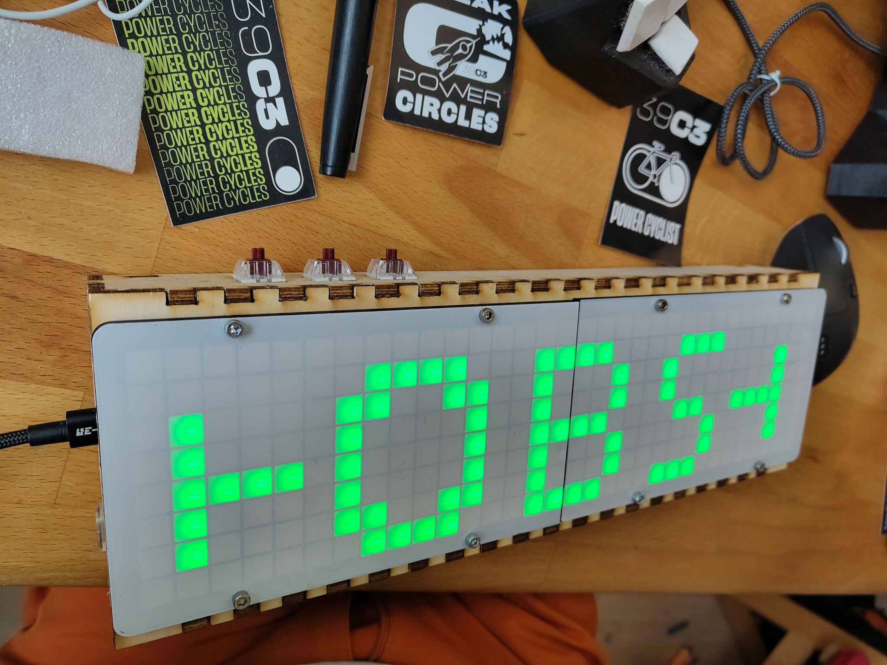
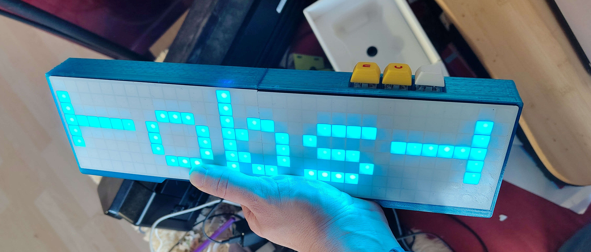

# Hardware Manual
Chose between the two variants:
<figure style="display:flex;flex-flow: row;">
<figure>

<figcaption style="text-align:center;">
Lasercut version
</figcaption>
</figure>

<figure>

<figcaption style="text-align:center;">
Fully 3D-printed version
</figcaption>
</figure>

</figure>

## Required parts:

- ESP32 module, 30-Pin version.
- 3 cherry type keyswitches and matching keycaps
- [USB-C power module](https://www.amazon.de/dp/B0F2MNT26V)
- some wire
- crimping supplies ([see below](#crimping-supplies))
- for the 3D-printed case version:
    - 2x m3x8mm bolts
    - superglue
    - [the 3D-printed parts](case-3DPrint)
- for the partly-lasercut case version:
    - wood glue
    - hot glue
    - 8x m3x12mm bolts for securing the display
    - 8x m3 nuts for securing the display [standart OpenBikeSensor nut, you might already have this]
    - 8x m3x8mm bolts. 2x for ESP32, 4x for back cover.  [standard OpenBikeSensor bolt, you might already have this]
    - [the lasercut and 3D-Printed parts for this case](case-Lasercut)

> [!NOTICE]
> If you have bought crimping pliers to build OpenBikeSensors you might have all the crimps required at hand in the box with your pliers.

### Crimping Supplies
- about 12 JST-XH Crimps (BXH-001T-P0.6)
- about 2 male JST-XH Crimps
- 3-Pin JST-XH Board connector (for the display pins on the ESP32) [male]
- 2-Pin JST-XH connector (for the display power cable) [female]
- 2-Pin **Male** JST-XH connector (for the usb power module) [male]
- 3-Pin JST-XH connector (for the display cable) [female]
- 5-Pin JST-XH Board connector (for the button pins on the ESP32) [male]
- 5-Pin JST-XH connector (for the button cable) [female]

## Required Tools
- JST-XH Crimping pliers.
- soldering iron and soldering supplies.

## Case
There are two case options:
- [fully 3D-printable version.](case-3DPrint)
- [Partly 3D-printed and partly laser-cut version.](case-Lasercut)