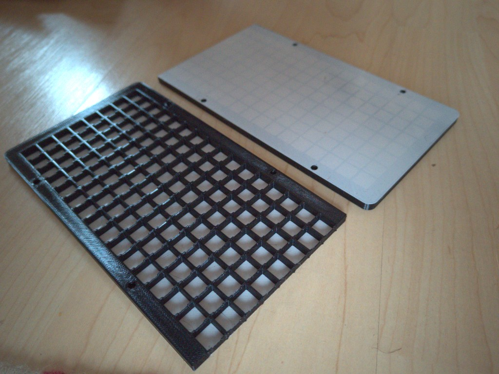
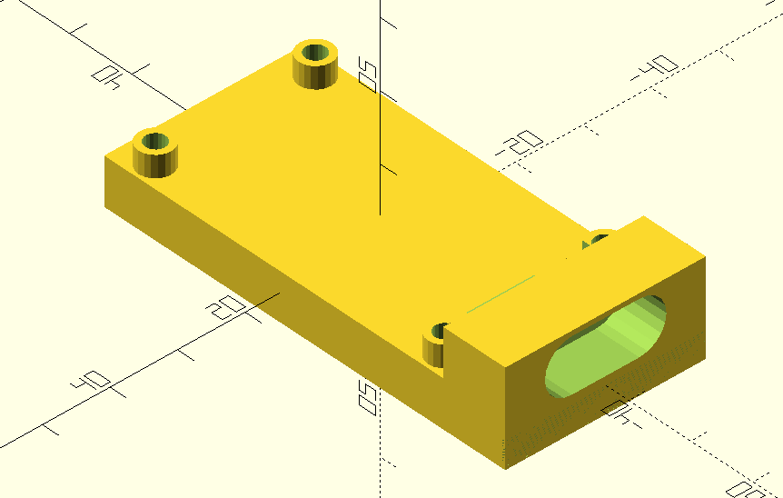
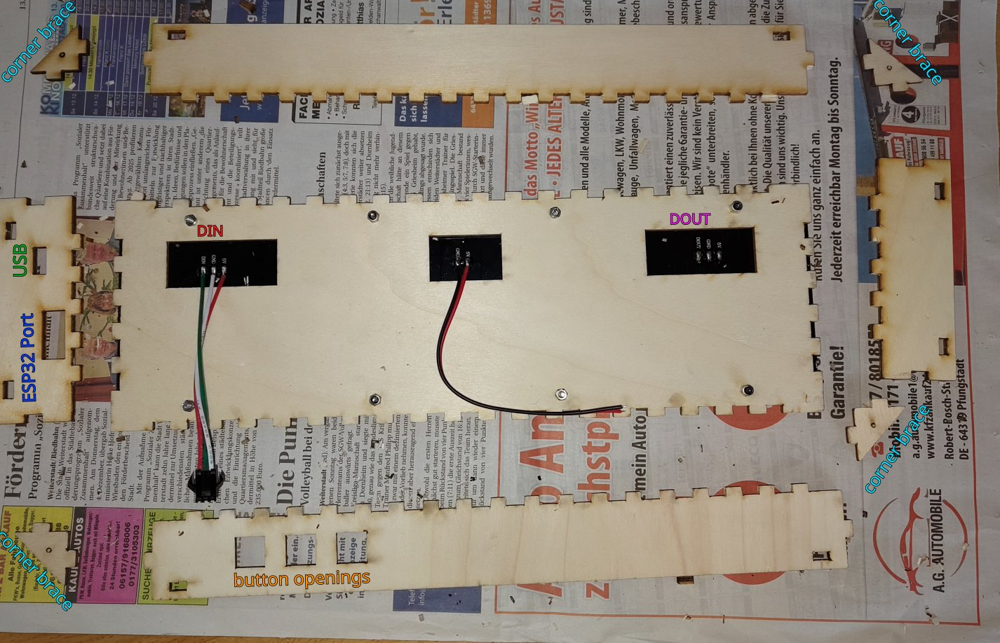
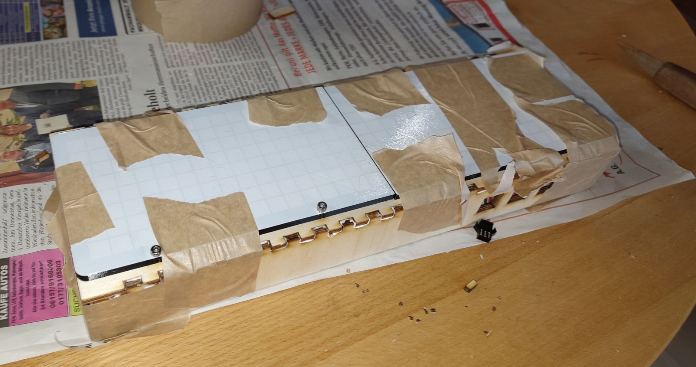
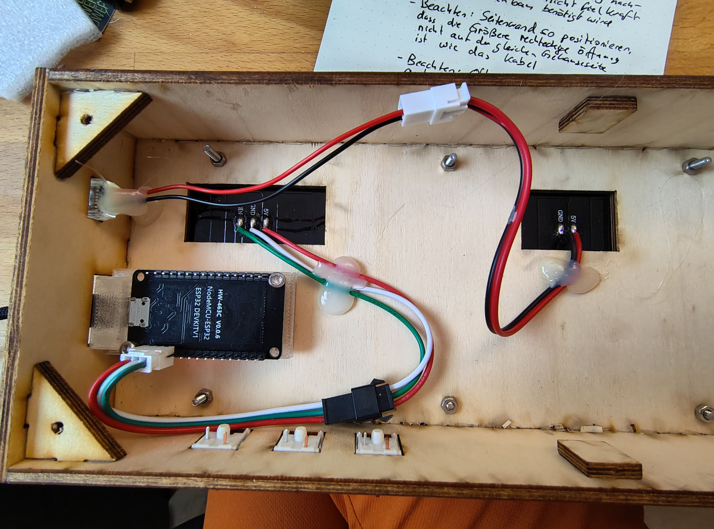
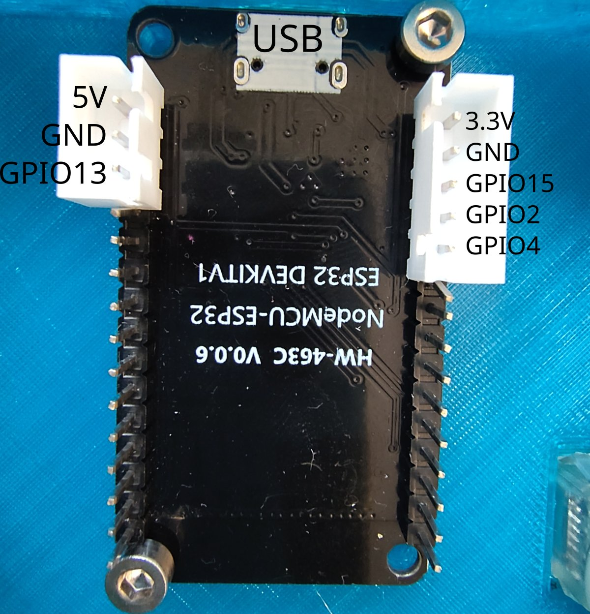
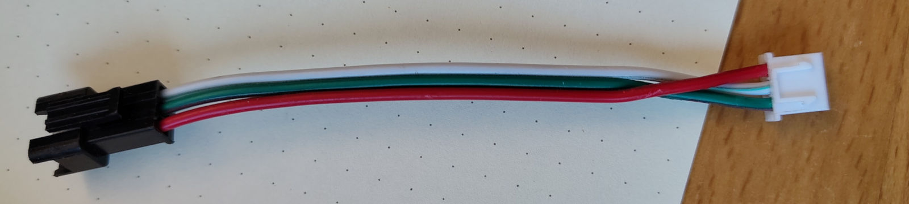
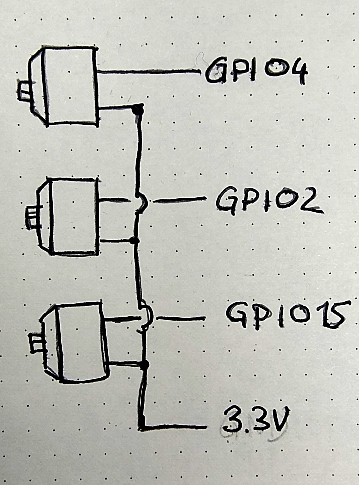
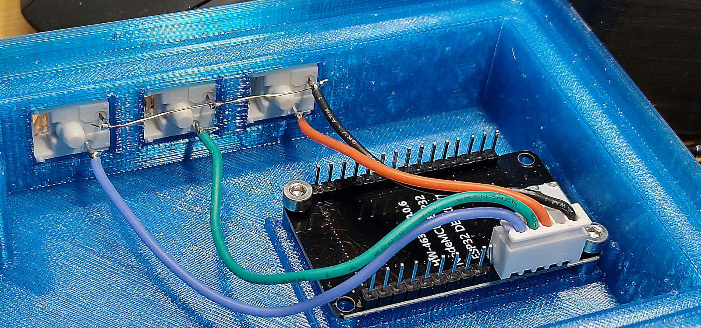

# Lasercut case
This case uses both lasercut and 3D-Printed parts. Once you have manufactured the parts you can proceed to the [assembly](#assembly).

## Parts to lasercut
Cut the parts from [lasercut_parts.svg](lasercut_parts.svg) out of 4mm plywood.

Optionally make the back wall (the part held in place with 4 screws) out of 4mm acrylic instead.

Sensibly select the vectors you want to cut/burn in (burn in the logo / cut all other vectors).

## Parts to 3D-Print

### Diffuser
3D-print the diffuser from [8x32_neopixel_diffusor.stl](./8x32_neopixel_diffuser.stl).

Layer height is meant to be 0.2mm. With a filament change to black after the bottom layer color bleed between pixels can be is minimized. The printer needs to be well-calibrated for this to print, a smooth print surface with PETG is recommended.

### ESP32 Mount
3D-print the ESP32 mount for later glue-in from [esp32mount.stl](./esp32mount.stl)

## Assembly

1. Put the LED matrix on top of the large plate with the three rectangular holes. Pull the cables from the display through the holes.
2. Using the m3x12mm bolts and matching nuts, fasten the diffuser over the LED display. Wiggle it a bit until it fits nicely.

### Glueing

Lay out the plywood parts as shown in the figure.

> [!NOTE]
> The layout is chosen such that the buttons, ESP32 Port  and USB port openings are all on the same side of the case. To achieve this, make sure that they lie on the side labeled with DIN in the figure. Notice that also the led matrix has a marking "DIN" on the respective side.

> [!NOTE]
> Make sure that the larger ESP32 opening in the sidepanel does not lead to the ESP32 overlapping the hole in the display panel where the DIN cable comes out.

Use wood glue with a drying time that allows for some rework - If you use fast-drying glue (e.g. 5 minutes) you will be hard-pressed to put everything int o the right order before it's too late.

1. Dry-fit all plywood parts parts. If clearances are too low, use a box cutter or other knife to adapt fit.
2. Starting with at the left put glue on all the contact surfaces of the parts placed around the display module.
    - You will be glueing: Sidepanel -> Corner brace -> Side Panel -> Corner brace etc...
    - <B>Don't forget the corner braces, you can't add them later once glue has dried.</B>
    - Once glue was added, stick the part where it needs to go.
    - Proceed with the next part.
3. When all parts are glued, use packing tape or similar to affix the parts against each other with a bit of pressure.
    
4. Once the case is dry, glue in the ESP32 mount and press-fit the buttons and the USB plug. You can also use packing tape to put some pressure on the ESP module while glue dries.
5. Add strain relief using hot glue to ensure the cables on the back of the display as well as the one on the USB Socket don't get twisted too much during further assembly.
   

### Wiring

1. Secure the ESP32 to the mount using two m3x8mm screws. Use two holes diagonally opposite of each other. The remaining two holes can be left empty. 
2. Remove the pins from the JST-XH PCB connectors.
3. Stick the JST-XH-PCB connectors on the PCB pins as shown.

4. Crimp female crimps onto the three-wire cable connected to "DIN" of the LED matrix. Stick them in a 3-pin connector [female] in the order matching the three pin connector on the ESP. (either to the one coming out of the LED matrix or to the small pigtail cable that came with the Display).

> [!WARNING]
> Wrong cable order may fry your LED matrix. Make triple sure that the matching pins are connected. **The pin order differs between the Display matrix and the ESP.** On the LED Matrix the DIN pin is in the middle, it needs to connect to GPIO14 on the ESP, which is at the edge.

5. Wire the buttons like shown in the diagram (lines that do not touch are not connected). Solder the contacts to the buttons and use crimp contacts at the other end of the wire. 
   

6. After soldering, connect your button wires to the JST connector like shown in the photo. **Remember to leave a gap, connect the common connection to 3.3V and the buttons to GPIO15, GPIO2 and GPIO4.**
   

7. Crimp male contacts onto the two wires of the USB connector. Crimp female contacts onto the power wire in the center of the LED matrix. Insert crimps into connectors and connect so that red and black matches. Connect the connectors.

During longer high brightness operation use the USB connector to power the display. Otherwise the ESP may get quite warm due to the high current (up to 2 Amperes for our use case) required by the display. For flashing, connecting USB just to the ESP is fine. The bootup brighness is sufficiently reduced that the ESP USB port should be able to handle it.

Congratulations, your display is now complete, you can proceed to [flash the firmware](../../README.md).